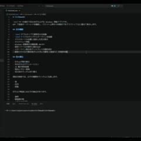

# CtrlHanabi

`Ctrl`キーの連打で花火を打ち上げる Windows 常駐アプリです。  
WPF で透過オーバーレイを描画し、ロケット上昇から炸裂までをデスクトップ上に重ねて表示します。



## 主な機能

- `Ctrl`ダブルタップで通常花火を起動
- `Ctrl`トリプルタップでスターマインを起動
- マウスカーソル位置に追従した花火表示
- タスクトレイ常駐
- Windows 起動時の自動起動 ON/OFF
- 設定ファイルの保存と読み込み
- スターマイン表示先ディスプレイの選択対応
  設定ファイルで表示先ディスプレイ番号（1始まり）を指定可能

## 花火演出

- 打ち上げ筒の表示
- 花火打ち上げアニメーション
- 3D 風の球状拡散
- 残光とグロー表現
- 花火色のランダム切り替え

現在の実装では、以下の種類をランダムに生成します。

- 菊
- 牡丹
- 冠菊

打ち上げ軌道には以下の演出があります。

- 通常
- 銀竜風の尾
- 小花の途中開花

## 使い方

1. アプリを起動します。
2. 常駐後、任意の場所で`Ctrl`キーを素早く2回押すと通常花火が表示されます。
3. `Ctrl`キーを素早く3回押すとスターマインが表示されます。

終了方法:

- タスクトレイアイコンのメニューから`終了`
- `Ctrl`キーを5回連打して終了確認ダイアログを表示

## タスクトレイメニュー

- `Windows起動時に実行`
  レジストリ `HKCU\Software\Microsoft\Windows\CurrentVersion\Run` を使用
- `毎時スターマインを打ち上げ`
  ON の場合、毎時 `59分30秒` になったら画面中央からスターマインを打ち上げます
- `設定をリセット`
  設定ファイルを既定値に戻します
- `終了`

## 動作環境

- Windows x64
- `.NET 10`
- `WPF`

## 依存ライブラリ

このリポジトリは、現時点でサードパーティ製の NuGet パッケージや同梱外部ライブラリに依存していません。  
詳細は [THIRD_PARTY_NOTICES.md](/abs/path/c:/Users/alpin/source/codex/CtrlHanabi/CtrlHanabi/THIRD_PARTY_NOTICES.md) を参照してください。

注意:

- キーボード入力の検知は Windows API の低レベルキーボードフックとポーリングを併用しています。x86 環境では入力検知が安定しない可能性があるため、動作対象は x64 環境に限定します。
- このアプリは通常ユーザー権限で起動します。Windows の権限分離により、タスクマネージャーなど管理者権限で動作するウィンドウがアクティブな間の `Ctrl` 連打は通常ユーザー権限のプロセスから検知できません。必要に応じて CtrlHanabi を管理者として起動するか、署名済み `uiAccess` アプリとして信頼済みフォルダーに配置してください。

## ビルドと実行

以下のコマンドで x64 向けにビルド・実行できます。

```powershell
dotnet build
dotnet run
```

## 設定ファイル

保存先:

`%LocalAppData%\CtrlHanabi\settings.json`

既定値:

```json
{
  "DoubleTapThresholdMs": 320,
  "CooldownMs": 500,
  "ParticleCount": 90,
  "ExplosionRadius": 110,
  "HourlyStarmineEnabled": false,
  "StarmineLaneLeftEnabled": true,
  "StarmineLaneCenterEnabled": true,
  "StarmineLaneRightEnabled": true,
  "StarmineDisplayIndex": 1,
  "UiLanguage": null
}
```

各項目の意味:

- `DoubleTapThresholdMs`
  `Ctrl`連打（2連打/3連打）の入力として扱う最大間隔
- `CooldownMs`
  連続発火を抑える待機時間
- `ParticleCount`
  花火粒子数の基準値
- `ExplosionRadius`
  爆発半径の基準値
- `HourlyStarmineEnabled`
  毎時 `59分30秒` にスターマインを打ち上げるかどうか
- `StarmineLaneLeftEnabled`
  スターマインの左レーンを有効にするかどうか
- `StarmineLaneCenterEnabled`
  スターマインの中央レーンを有効にするかどうか
- `StarmineLaneRightEnabled`
  スターマインの右レーンを有効にするかどうか
- `StarmineDisplayIndex`
  スターマインを表示するディスプレイ番号（1始まり）。範囲外の値は `1` として扱われます
  `1` がメインディスプレイです。`2` 以降は残りのディスプレイをデスクトップ上の並び順で選びます
- `UiLanguage`
  メニュー表示言語。`null`、未指定、`"auto"` の場合は Windows の UI 言語から自動判定します。明示指定する場合は `"ja"` または `"en"` を指定できます

注意:

- 設定 UI はないので、修正する場合は `settings.json` を直接編集してください。

## ログ設定（環境変数）

Direct3D 関連のログは `%LocalAppData%\CtrlHanabi\d3d11.log` に出力されます。  
出力可否は以下の環境変数で制御できます。

- `CTRLHANABI_LOG`
  全体ログスイッチ。`1` で有効、`0` で無効
- `CTRLHANABI_D3D11_LOG`
  互換用スイッチ。`CTRLHANABI_LOG` が未設定の場合のみ参照され、`1` で有効

優先順位:

1. `CTRLHANABI_LOG=0` の場合は常にログ無効
2. `CTRLHANABI_LOG=1` の場合はログ有効
3. `CTRLHANABI_LOG` 未設定時は `CTRLHANABI_D3D11_LOG` を参照
